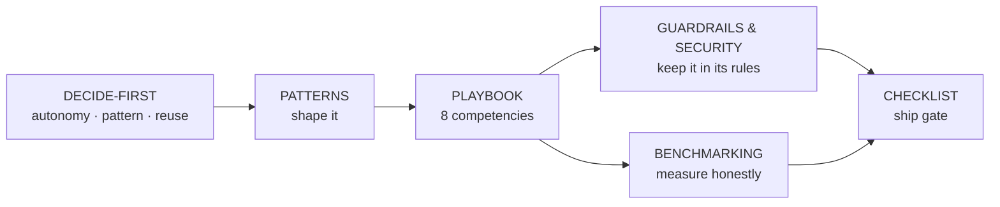

# Agent Groundwork

*A decision-first playbook for building agents — lay the groundwork before you build.*

A **research-baked kickstart** for building LLM agents — so the next build starts with
the right structure instead of refactoring into it.

> **The thesis** (worth internalizing): *"Most agent failures are orchestration
> failures, not model failures."* The model is one fallible component; reliability
> comes from the **harness** around it — tools, control flow, memory, verification,
> retries, evals, and a human in the loop where it matters. This kit is about that
> harness.

This is **vendor-neutral**. It leans on public authorities — Anthropic's
[Building Effective Agents](https://www.anthropic.com/engineering/building-effective-agents),
the [12-Factor Agents](https://github.com/humanlayer/12-factor-agents) methodology,
and the 2026 framework/eval/memory landscape — and uses **ClaimLens** (a 24-hour
hackathon project) as *one worked example*, including where it fell short. It is not
a pitch for any one tool or for ClaimLens.

## How to use it

1. **Before writing code**, run [`DECIDE-FIRST.md`](./DECIDE-FIRST.md) — the
   conversation to have *first*: how autonomous, which pattern, build-vs-reuse. Fill
   in the one-page spec at the bottom.
2. Know **what kind** of agent it is ([`AGENT-TYPES.md`](./AGENT-TYPES.md)), pick your
   shape from [`PATTERNS.md`](./PATTERNS.md) (workflow patterns + closed-loop / DAG /
   self-healing / autonomous / HITL), and copy a proven structure from
   [`ARCHITECTURE-REFERENCES.md`](./ARCHITECTURE-REFERENCES.md).
3. Build against the eight competencies in [`PLAYBOOK.md`](./PLAYBOOK.md) — each with
   **practices**, **what to measure**, and **what to reuse instead of building**.
4. Make it safe: [`GUARDRAILS-AND-SECURITY.md`](./GUARDRAILS-AND-SECURITY.md) —
   prompt-injection defense + how to keep the agent **inside its rules** (least
   privilege, containment, human gates on irreversible actions).
5. Prove it: [`BENCHMARKING.md`](./BENCHMARKING.md) — the standardized agent
   benchmarks *and* the honest task-eval methodology (why a leaderboard isn't enough).
6. Don't reinvent: [`OSS-LANDSCAPE.md`](./OSS-LANDSCAPE.md) is the curated,
   source-cited map of frameworks/libraries per competency.
7. Gate yourself with [`CHECKLIST.md`](./CHECKLIST.md) before you call it done.

## What's here

| File | What it's for |
|---|---|
| [DECIDE-FIRST.md](./DECIDE-FIRST.md) | The pre-build decision framework + a fill-in spec. **Start here.** |
| [AGENT-TYPES.md](./AGENT-TYPES.md) | The **kinds** of agents (copilot, RAG, tool, research, coding, verification, computer-use, multi-agent…) → which shape/autonomy each wants |
| [PATTERNS.md](./PATTERNS.md) | Agent shapes & when each fits (incl. closed-loop · DAG · self-healing · autonomous · HITL) |
| [ARCHITECTURE-REFERENCES.md](./ARCHITECTURE-REFERENCES.md) | How famous agents are actually built (Anthropic Research, Cognition/Devin, context engineering) — cited shapes to copy |
| [PLAYBOOK.md](./PLAYBOOK.md) | The 8 competencies → practices · metrics · what to reuse |
| [GUARDRAILS-AND-SECURITY.md](./GUARDRAILS-AND-SECURITY.md) | Prompt-injection defense, defense-in-depth, **agent containment / least privilege** (keep it in its rules) |
| [BENCHMARKING.md](./BENCHMARKING.md) | Standardized agent benchmarks (GAIA, SWE-bench, τ²-bench…) + honest task-eval methodology |
| [OSS-LANDSCAPE.md](./OSS-LANDSCAPE.md) | Curated, cited frameworks/libraries — reuse, don't rebuild |
| [CHECKLIST.md](./CHECKLIST.md) | One-page pre-flight before shipping |
| [SKILL.md](./SKILL.md) | Packaged as a Claude Code skill (open-source it as-is) |

## Open-sourcing this

Two equally valid forms (it's authored to be both):
- **As a process** — copy this folder into any repo; it's just Markdown.
- **As a skill** — [`SKILL.md`](./SKILL.md) is a ready Claude Code skill: drop the
  folder into `~/.claude/skills/agent-groundwork/` (or a repo's `.claude/skills/`).

MIT licensed; attribute the cited sources. PRs that add measured data or new
patterns are the whole point.

## Related

- **[Multi-Agent Loop Kit](https://github.com/anshulixyz/multi-agent-loop-kit)** —
  a companion open-source project for running **multiple** coding/agent workers in a
  supervised loop (path ownership, task briefs, approval gates, journals). This
  playbook is the *"how to design one agent well"* layer; the Loop Kit is the
  *"how to coordinate many, safely"* layer. They pair naturally: decide the agent
  here, then scale it out there.
- **[OWASP Secure Agent Playbook](https://github.com/OWASP/secure-agent-playbook)** —
  the authoritative, **security-specific** reference: OWASP-grounded *plays/skills*
  that agents run (agent audits, prompt-injection testing, MCP review, multi-agent
  threat modeling; CWE/ASVS/NIST mappings). **Different scope, not a competitor** —
  this playbook is the *general build-decision* layer; for production security
  hardening + red-team automation, use OWASP's plays (we point to them in
  [`GUARDRAILS-AND-SECURITY.md`](./GUARDRAILS-AND-SECURITY.md)). Honestly: theirs is
  deeper on security; ours is broader on *how to build the agent in the first place*.

## The honest caveat (so this stays useful, not dogma)

No single pattern or tool is universally right — that's exactly why
[`DECIDE-FIRST.md`](./DECIDE-FIRST.md) exists. Treat every recommendation here as a
*default to argue with*, and replace claims with **your own measured numbers** as
soon as you have them. Where this kit cites a benchmark or a tool's positioning, the
source is linked; where it states our own experience, it's marked as such.
</content>
